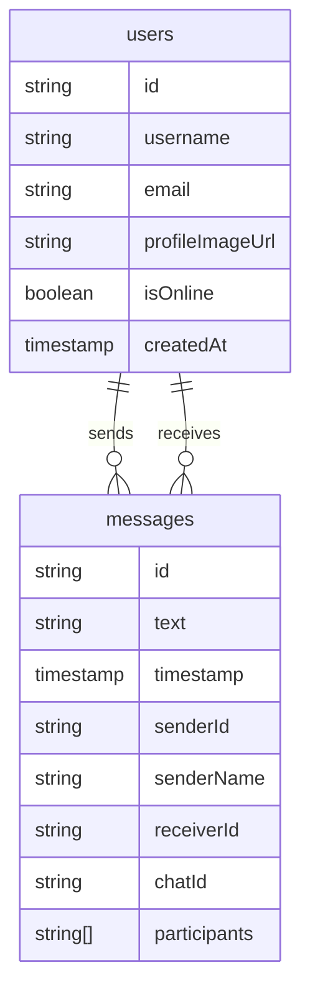

# Firestore 設計メモ（ドラフト）

## 現状データ構造（確認済み）

- `users`
  - `username` / `email` / `profileImageUrl` / `isOnline` / `createdAt`

- `messages`
  - `text` / `timestamp` / `senderId` / `senderName` / `receiverId`
    - `chatId` / `participants[]`
- `vue-chat`（空）

## 現状の構造（概念図）

## 追加予定（設計検討中）

- threads（相談投稿）
- threadComments（スレッドコメント）
- directMessages（DM分離）

erDiagram
users ||--o{ threads : creates
threads ||--o{ threadComments : has
users ||--o{ threadComments : posts
users ||--o{ directMessages : sends
users ||--o{ directMessages : receives

threads {
    string id
    string title
    string body
    string[] tags
    string authorId
    timestamp createdAt
    timestamp updatedAt
}

threadComments {
    string id
    string threadId
    string authorId
    string body
    timestamp createdAt
}

directMessages {
    string id
    string chatId
    string senderId
    string receiverId
    string text
    timestamp timestamp
}

## 論点メモ

- messages を directMessages に移行するか、互換レイヤーで併用するか
- threadComments をサブコレクションにするか独立コレクションにするか
- chatId の生成規則と索引設計
