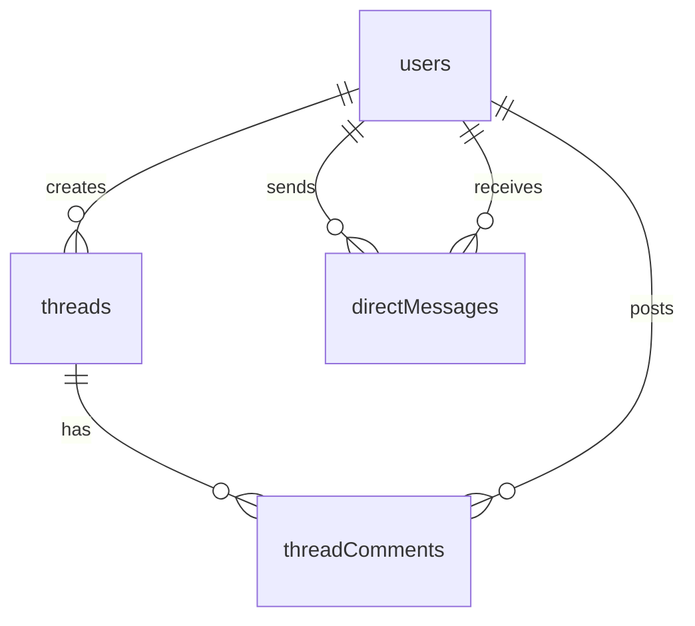

# Firestore 設計

`#25 threads / threadComments / directMessages のコレクションと主要フィールドを確定する` の成果物。
この文書は、Firestore の対象コレクション、主要フィールド、配置方針を定義し、後続 Issue の前提を揃えるための基準とする。

## 目的

- スレッド、コメント、DM の保存先を明確にする
- 各コレクションの必須フィールドと用途を揃える
- `#26` 移行方針、`#27` `chatId`、`#28` クエリ / インデックス、`#29` 権限方針の前提を確定する

## 現状実装（As-Is）

現行コードでは、主に次の構成が使われている。

- `users`
  - 利用箇所: 登録時のプロフィール保存、ユーザー一覧、DM 相手名取得
  - 現在確認できるフィールド: `username`, `email`, `createdAt`, `profileImageUrl`, `isOnline`
- `messages`
  - 利用箇所: 1対1 DM の保存と購読
  - 現在確認できるフィールド: `text`, `timestamp`, `senderId`, `senderName`, `receiverId`, `chatId`, `participants`
- `users/{userId}/messages/latest`
  - 利用箇所: ユーザー一覧の最新メッセージ表示
  - 現状は派生データに近く、正式なメッセージ保存先としては扱わない

## 今回確定する To-Be

- スレッド投稿は `threads`
- スレッドコメントは `threads/{threadId}/comments`
- 1対1 DM は `directMessages`

## 採用構成

### コレクション一覧

| 種別 | パス | 用途 |
|---|---|---|
| ユーザー | `users/{userId}` | プロフィール、表示名、オンライン状態の保持 |
| スレッド | `threads/{threadId}` | 相談投稿の本文、タグ、作成者、集計情報の保持 |
| スレッドコメント | `threads/{threadId}/comments/{commentId}` | 1つのスレッドに属するコメントの保持 |
| DM | `directMessages/{messageId}` | 1対1 のメッセージ保持 |

### リレーション

```mermaid
erDiagram
users ||--o{ threads : creates
users ||--o{ directMessages : sends
users ||--o{ directMessages : receives
threads ||--o{ threadComments : has
users ||--o{ threadComments : posts
```

## フィールド定義

### users

既存コレクション。`#25` の主対象ではないが、関連先として前提を揃える。

| フィールド | 必須 | 型 | 用途 |
|---|---|---|---|
| `username` | Yes | string | 表示名 |
| `email` | Yes | string | ログインユーザーの識別補助 |
| `profileImageUrl` | No | string | プロフィール画像 URL |
| `isOnline` | No | boolean | オンライン状態表示 |
| `createdAt` | Yes | timestamp | ユーザー作成日時 |
| `updatedAt` | No | timestamp | プロフィール更新日時 |

### threads

相談投稿の親コレクション。

| フィールド | 必須 | 型 | 用途 |
|---|---|---|---|
| `title` | Yes | string | スレッドタイトル |
| `body` | Yes | string | 相談本文 |
| `tags` | No | string[] | カテゴリ、検索、絞り込み |
| `authorId` | Yes | string | 投稿者の `users/{userId}` |
| `authorName` | Yes | string | 一覧表示用の投稿者名キャッシュ |
| `commentCount` | No | number | コメント件数の集計表示 |
| `lastCommentAt` | No | timestamp | スレッド一覧の更新順制御 |
| `createdAt` | Yes | timestamp | 作成日時 |
| `updatedAt` | Yes | timestamp | 本文更新やメタ更新の日時 |

### threads/{threadId}/comments

スレッド配下のサブコレクションとして扱う。

| フィールド | 必須 | 型 | 用途 |
|---|---|---|---|
| `body` | Yes | string | コメント本文 |
| `authorId` | Yes | string | コメント投稿者の `users/{userId}` |
| `authorName` | Yes | string | 一覧表示用の投稿者名キャッシュ |
| `createdAt` | Yes | timestamp | 作成日時 |
| `updatedAt` | Yes | timestamp | 編集日時。初回作成時は `createdAt` と同値で開始してよい |
| `parentCommentId` | No | string | 将来の返信階層対応用。現時点では未使用想定 |

### directMessages

新しい DM の正式な保存先。

| フィールド | 必須 | 型 | 用途 |
|---|---|---|---|
| `chatId` | Yes | string | 1対1 DM を識別する会話単位 ID |
| `senderId` | Yes | string | 送信者の `users/{userId}` |
| `senderName` | Yes | string | 表示用の送信者名キャッシュ |
| `receiverId` | Yes | string | 受信者の `users/{userId}` |
| `text` | Yes | string | メッセージ本文 |
| `createdAt` | Yes | timestamp | 送信日時 |

#### 補足

- `chatId` は必須フィールドとして持つが、具体的な生成規則は `#27` で確定する
- `participants` は現時点では必須にしない。参加者一覧クエリが必要になった段階で後続 Issue で追加を検討する
- `senderName` は表示用キャッシュとして保持する。`senderId` を正本参照とし、表示名変更による過去データとの差分は許容する

## コメント配置方針

### 採用案

`threadComments` は独立コレクションにせず、`threads/{threadId}/comments/{commentId}` のサブコレクションとして配置する。

### 採用理由

- コメントは基本的に「特定スレッドの詳細画面で時系列表示する」使い方が中心になる
- 親スレッドとの所属関係が Firestore のパスで明確になる
- スレッド単位の取得、購読、権限制御を組み立てやすい
- `#25` 時点の MVP スコープでは、全スレッド横断のコメント検索や全コメント管理画面は必須ではない
- 将来横断取得が必要になっても `collectionGroup('comments')` で対応余地がある

### 今回採用しない案

`threadComments/{commentId}` の独立コレクション案は、横断検索や全件集計には向くが、現段階ではスレッド従属の関係をパスで表したほうが単純で、Security Rules も整理しやすいため採用しない。

## 現行 `messages` との関係

- 現行の 1対1 DM は `messages` を使用している
- 今後の正式な DM 保存先は `directMessages` とする
- `messages` を互換維持のために残す前提は置かない
- `messages` の移行 / 廃止 / ロールバック条件は `#26` で確定する

## 後続 Issue への引き継ぎ

### `#26` 既存 `messages` の移行方針

- `messages` から `directMessages` へ移すか、一定期間併用するかを決める
- `createdAt` と現行 `timestamp` の扱いを揃える必要がある
- `users/{userId}/messages/latest` を残すか再設計するかを決める必要がある

### `#27` DM 識別用 `chatId`

- `directMessages.chatId` の生成規則を確定する
- `chatId` の衝突回避方針を決める

### `#28` クエリ / インデックス

- `threads` 一覧の並び順
- `threads/{threadId}/comments` の取得順
- `directMessages` の `chatId + createdAt` を前提にした取得方法

### `#29` read/write 権限方針

- `threads` は認証ユーザーの作成、必要に応じて本人編集
- `threads/{threadId}/comments` は認証ユーザーの投稿、必要に応じて本人編集
- `directMessages` は `senderId` / `receiverId` の当事者だけが read/write できる前提で設計する

## この文書でまだ確定していないこと

- `chatId` の具体的な生成規則
- 必要な複合インデックスの一覧
- Security Rules の実装詳細
- `messages` から `directMessages` への移行方法
