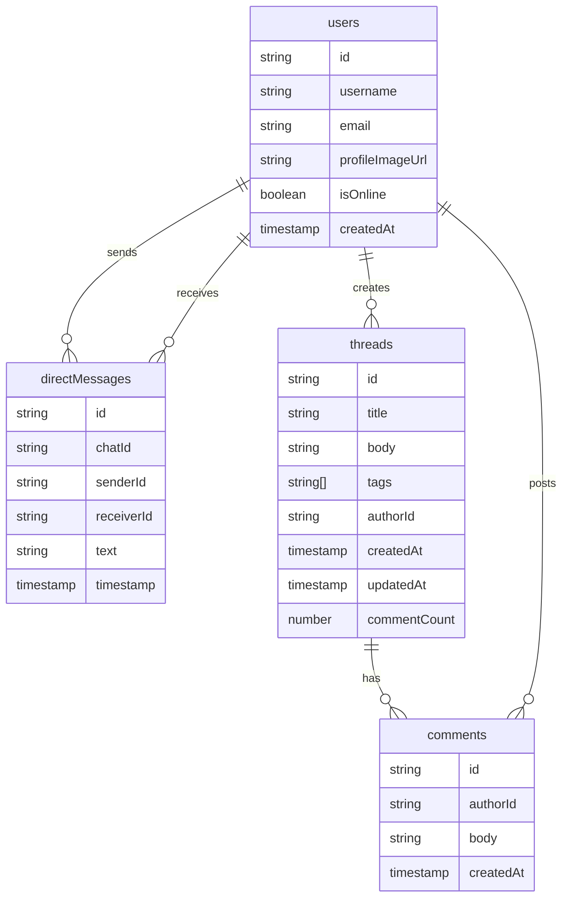

# Firestore 設計（確定版）

## コレクション一覧と方針

| コレクション | 用途 | 状態 |
|---|---|---|
| `users` | ユーザープロフィール | 確定・運用中 |
| `messages` | 既存DM（後方互換のため保持） | 非推奨・移行対象 |
| `directMessages` | 1対1 ダイレクトメッセージ（新規） | **確定** |
| `threads` | スレッド投稿 | **確定** |
| `threads/{id}/comments` | スレッドへのコメント（サブコレクション） | **確定** |

---

## 確定済みデータ構造

### `users`

```
users/{userId}
```

| フィールド | 型 | 説明 |
|---|---|---|
| `username` | string | 表示名 |
| `email` | string | メールアドレス |
| `profileImageUrl` | string | プロフィール画像 URL |
| `isOnline` | boolean | オンライン状態 |
| `createdAt` | timestamp | 登録日時 |

---

### `directMessages`

```
directMessages/{messageId}
```

| フィールド | 型 | 説明 |
|---|---|---|
| `chatId` | string | 会話識別子。送受信者の UID を昇順ソートし `_` で連結（例: `uid_A_uid_B`） |
| `senderId` | string | 送信者の UID |
| `receiverId` | string | 受信者の UID |
| `text` | string | メッセージ本文 |
| `timestamp` | timestamp | 送信日時（`serverTimestamp()` で設定） |

**chatId 生成規則:** `[uid1, uid2].sort().join('_')`

> Firebase UID は 28 文字の英数字のみで構成されアンダースコアを含まないため、`_` を区切り文字として使用しても曖昧さは生じない。

---

### `threads`

```
threads/{threadId}
```

| フィールド | 型 | 説明 |
|---|---|---|
| `title` | string | スレッドタイトル |
| `body` | string | 本文 |
| `tags` | string[] | タグ一覧（任意） |
| `authorId` | string | 投稿者の UID |
| `createdAt` | timestamp | 投稿日時 |
| `updatedAt` | timestamp | 最終更新日時 |
| `commentCount` | number | コメント数（denormalize して一覧表示を高速化） |

---

### `threads/{threadId}/comments`（サブコレクション）

```
threads/{threadId}/comments/{commentId}
```

| フィールド | 型 | 説明 |
|---|---|---|
| `authorId` | string | コメント投稿者の UID |
| `body` | string | コメント本文 |
| `createdAt` | timestamp | 投稿日時 |

**配置方針: サブコレクションを採用**

理由:
- コメントは常にスレッド単位で取得するため、サブコレクションのクエリ効率が最適
- Security Rules でスレッド → コメントの階層的なアクセス制御がシンプルに書ける
- コレクショングループクエリ（`collectionGroup('comments')`）で全コメント横断検索も可能

---

## 全体 ER 図


```mermaid
erDiagram
    users ||--o{ directMessages : "sends"
    users ||--o{ directMessages : "receives"
    users ||--o{ threads : "creates"
    threads ||--o{ comments : "has"
    users ||--o{ comments : "posts"

    users {
        string id
        string username
        string email
        string profileImageUrl
        boolean isOnline
        timestamp createdAt
    }

    directMessages {
        string id
        string chatId
        string senderId
        string receiverId
        string text
        timestamp timestamp
    }

    threads {
        string id
        string title
        string body
        string[] tags
        string authorId
        timestamp createdAt
        timestamp updatedAt
        number commentCount
    }

    comments {
        string id
        string authorId
        string body
        timestamp createdAt
    }
```

---

## 既存 `messages` コレクションの移行方針

- 既存の `messages` コレクションは後方互換のためしばらく保持する
- 新規メッセージは `directMessages` コレクションへ書き込む
- `PrivateChatView.vue` の読み書き先を `directMessages` へ順次切り替える

---

## 後続タスクへのインプット

- **chatId 仕様**: `[senderId, receiverId].sort().join('_')` で確定
- **クエリ設計**:
  - DM 一覧: `where('chatId', '==', chatId)` + `orderBy('timestamp')`
  - スレッド一覧: `orderBy('createdAt', 'desc')`
  - コメント一覧: `threads/{id}/comments` + `orderBy('createdAt')`
- **Security Rules**: 次フェーズで `firestore.rules` に反映済み
- **インデックス**: `firestore.indexes.json` に複合インデックスを定義済み
